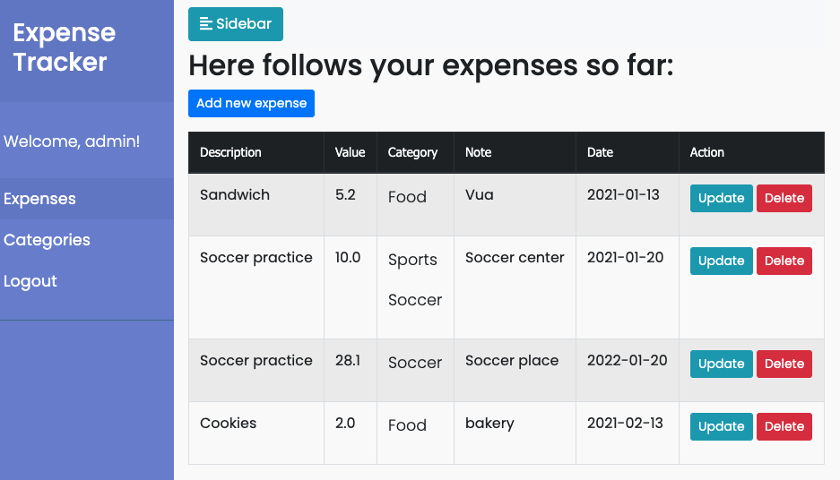
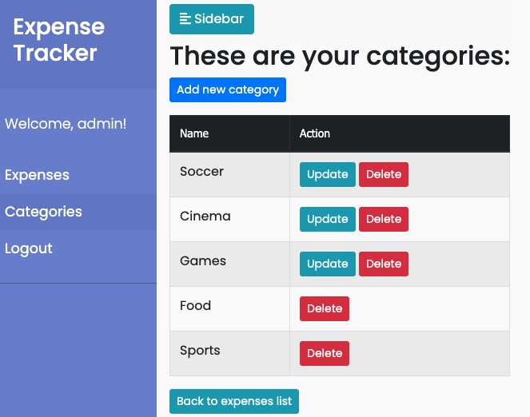
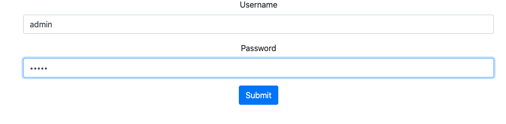

# Java_Spring_Thymeleaf-ExpenseTracker(v1)
A personal expense tracker built with Spring Boot - v1

## General info:

This is a personal expense tracker that enables the user to register their personal expenses and their respective categories.

## Technologies that are used:

* Spring Boot
* Spring Security
* Spring MVC
* Spring AOP
* Spring Data JPA
* Hibernate
* MySQL
* Thymeleaf
* Bootstrap

